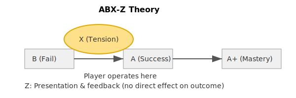

# ABX-Z Theory

*A design hypothesis about tension and engagement in games*

---

## Overview

This project proposes a simple idea:

> **A game becomes engaging when the player is kept in a state where success feels possible, but not guaranteed.**

This state is defined as the **X (Tension Zone)**.

The ABX-Z Theory is a conceptual model to describe how players experience challenge, success, and feedback in games.

This is a **design hypothesis**, not a proven theory.

---

## Model Structure

```
(B) Impossible  ←  Player  →  Achievable (A)  →  Mastery (A+)
                       ↑
               (X) Tension Zone
```

---

## Definitions

* **A (Achievable)**
  The player successfully reaches the goal.

* **A+ (Mastery)**
  The player not only succeeds, but optimizes or trivializes the challenge.

* **B (Impossible)**
  The player cannot reach the goal; failure is inevitable or frequent.

* **X (Tension Zone)**
  The core of gameplay.
  A state where success is uncertain but feels possible.
  This is where decision-making, focus, and engagement occur.

* **Z (Non-functional Elements)**
  Elements that do not affect the outcome directly, but enhance the experience:

  * Visual effects
  * Sound feedback
  * Animations
  * Presentation

---

## Key Insight

> **The most engaging moment in a game is not when the player wins,
> but when they believe they might win.**

The X zone represents this moment.

---

## Design Implications

A well-designed game should:

* Keep the player within the **X zone** as long as possible
* Avoid drifting too far into:

  * **A+ (too easy → boredom)**
  * **B (too hard → frustration)**
* Use **Z elements** to amplify emotional feedback without altering outcomes

---

## Example (Flight Simulation Prototype)

In a simple flight management simulation:

* The player adds flights into a looping system
* Fuel decreases over time
* Landing must be timed to avoid congestion or collision

The **X zone** occurs when:

* Adding one more flight could increase score
* But may also cause future congestion or failure

The player continuously decides:

> “Can I handle one more?”

This uncertainty creates tension and engagement.

---

## Purpose

This model is intended to:

* Provide a simple lens for thinking about game design
* Help identify where “fun” actually occurs
* Serve as a guideline for balancing challenge and player experience

---

## Future Work

* Apply ABX-Z Theory to different game genres
* Validate through prototypes and playtesting
* Compare with existing design frameworks (e.g. difficulty curves, flow)

---

## Notes

This is an evolving concept.
Feedback, criticism, and reinterpretation are welcome.


